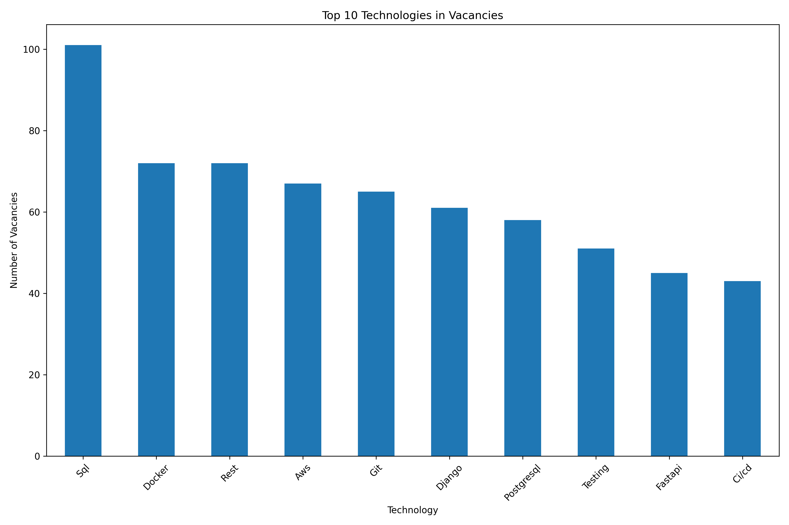
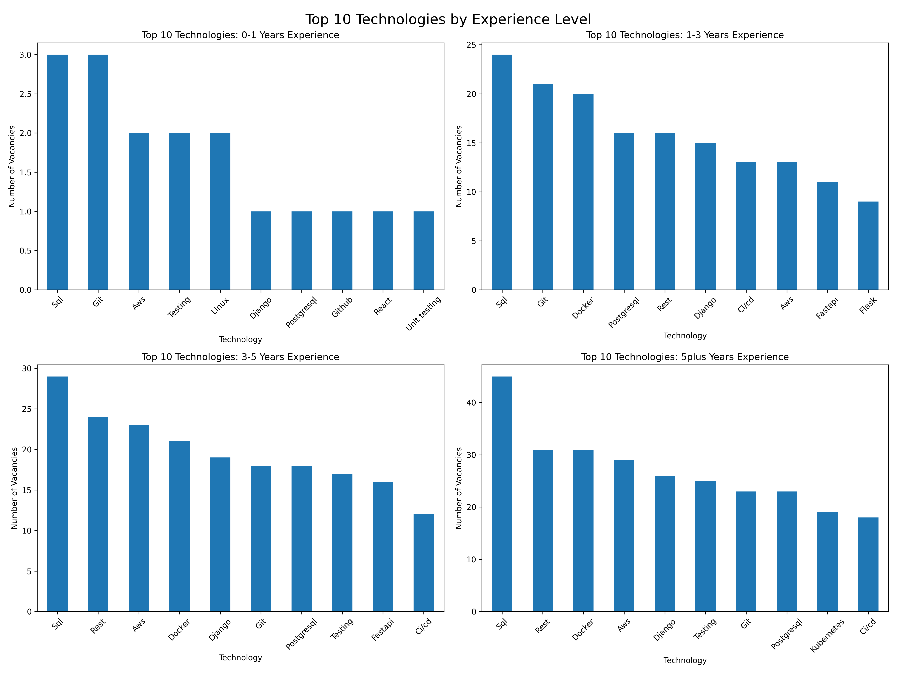
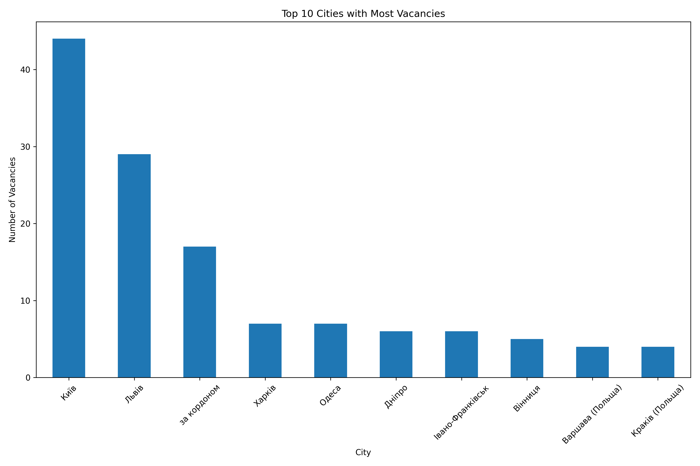
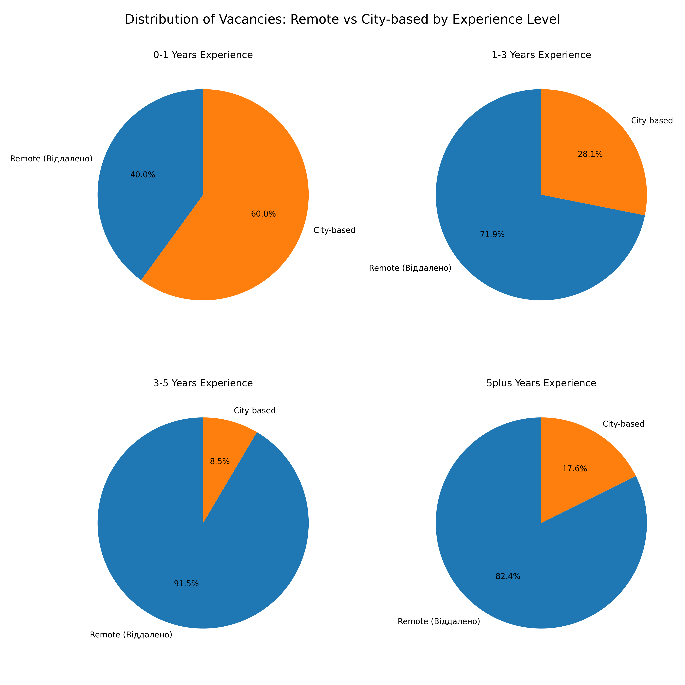
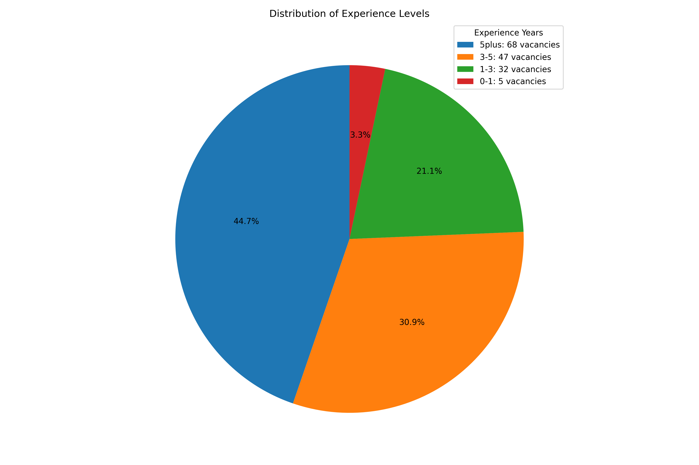

# Web Scraping and Data Analysis

This project is designed to scrape job vacancy data from [jobs.dou.ua](https://jobs.dou.ua/) using **Scrapy** and **Selenium**, analyze the data using **Pandas**, and visualize the results with **Matplotlib**.

## Features

1. **Web Scraping**:
    - Automates data collection for Python-related job vacancies.
    - Uses Selenium to handle dynamic content and pagination.
    - Scrapes detailed vacancy information such as:
        - Title
        - Company
        - Location
        - Salary
        - Description
        - Required Technologies
        - Experience Level


2. **Data Analysis**:
    - Analyzes the scraped data using Pandas to identify trends and insights.
    - Extracts technologies, experience levels, and salary ranges.


3. **Visualization**:
    - Generates visual insights using Matplotlib, including:
        - Top 10 technologies for each experience level.
        - Distribution of vacancies by city.
        - Posting trends by day of the week.
        - Remote vs city-based vacancies by experience.

## Project Structure

```plaintext
web-scraping-and-data-analysis/
├── .venv/                   # Virtual environment
├── plots/                   # Directory for saving generated plots
├── scraping_vacancies/      # Scrapy spider and configurations
│   ├── spiders/             # Scrapy spiders
│   │   ├── __init__.py
│   │   └── dou.py           # Dou.ua spider
│   ├── __init__.py
│   ├── items.py             # Defines scraped data structure
│   ├── middlewares.py       # Scrapy middlewares
│   ├── pipelines.py         # Optional post-processing
│   └── settings.py          # Scrapy project settings
├── .gitignore               # Ignored files for Git
├── analysis_vacancies.ipynb # Jupyter notebook for data analysis
├── README.md                # Project documentation
├── requirements.txt         # Python dependencies
├── scrapy.cfg               # Scrapy configuration file
├── technologies.txt         # Technology stack for filtering
└── vacancies.csv            # Output dataset from web scraping
```

## Installation

1. **Clone the Repository**:
```shell
git clone https://github.com/your-username/your-repo-name.git
cd your-repo-name
```

2. **Set Up a Virtual Environment:**
```shell
python3 -m venv venv
source venv/bin/activate  # On Windows: venv\\Scripts\\activate
```

3. **Install Dependencies:**
```shell
pip install -r requirements.txt
```

## Usage

1. **Run the Spider:** Use Scrapy to scrape the job vacancies:

```shell
scrapy crawl dou -o vacancies.csv 
```

2. **Analyze Data:** Use the provided Jupyter Notebook `analysis_vacancies.ipynb` to analyze the scraped data and generate plots.


3. **View Plots:** Plots will be saved in the `plots/` directory.

## Example Visualizations







## Dependencies

This project requires the following Python packages:

 - **Scrapy:** For web scraping.
 - **Selenium:** For interacting with dynamic web pages.
 - **Pandas:** For data manipulation and analysis.
 - **Matplotlib:** For data visualization.

See `requirements.txt` for the exact versions.
